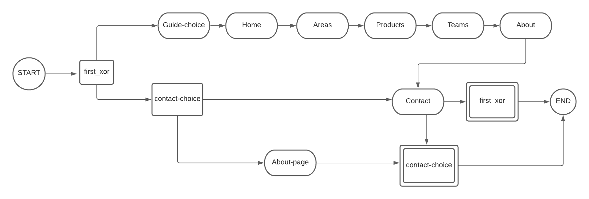
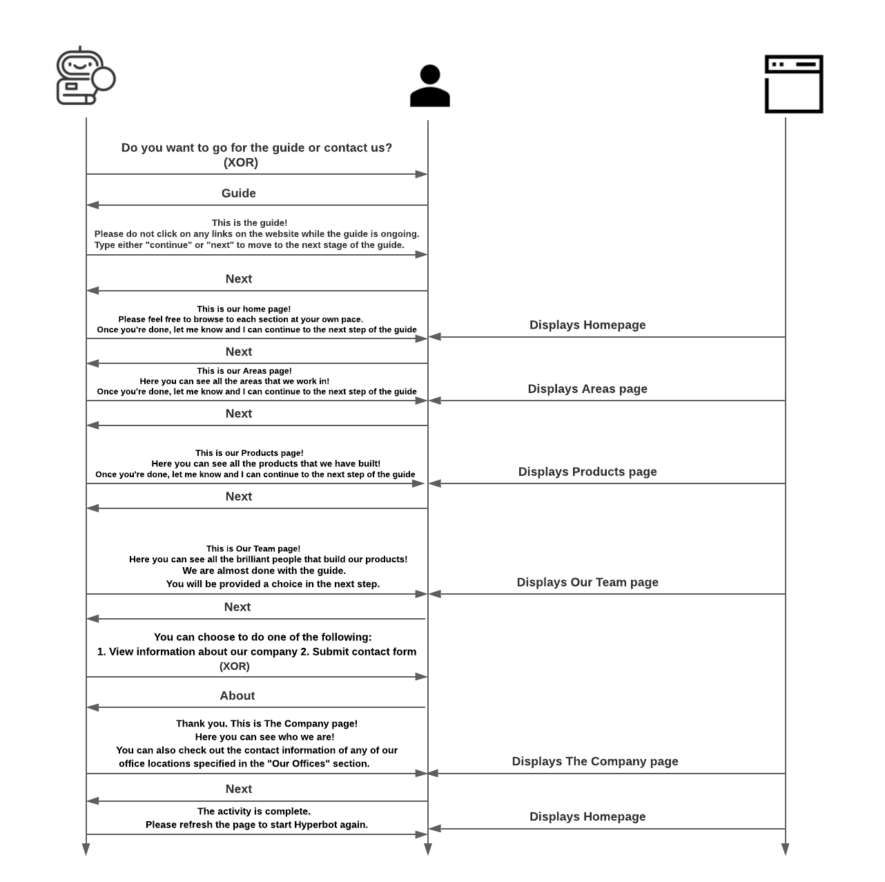

# Chatbot

The chatbot presents users with 2 options:

**1. Guide:** Navigates through `Homepage`, `Areas` page, `Products` page, `Our Team` page and then presents users an option to either go to `The Company` or `Contact Us` page. Depending on the user's choice, it displays the corresponding page and then exits.

**2. Contact:** Presents users an option to either go to `The Company` which displays contact information of each office of Hypercompany, or `Contact Us` page which provides a form to contact Hypercompany. Depending on the user's choice, it displays the corresponding page and then exits.

## Chatbot design:

## State Description of chatbot:

<table>
    <tr>
        <td><b>State</b></td>
        <td><b>Description</b></td>
        <td><b>Chatbot Message</b></td>
        <td><b>Expected Response</b></td>
        <td><b>Page Displayed</b></td>
        <td><b>Next Step</b></td>
        <td><b>Unknown message</b></td>
    </tr>
    <tr>
        <td>first_xor</td>
        <td>XOR which provides option to choose between "Guide" or "Contact"</td>
        <td>Hello! I am HyperBot, here to help you. Please type what you want to do:\n1. Guide through the website\n2. Contact Us</td>
        <td>["I want to go to guide","guide", "guide me","website","Website","Guide","1"] or ["I want to go to contact","contact", "contact us","Contact","2"]</td>
        <td>Current page where user has already navigated to</td>
        <td>Either "guide-choice" or "contact-choice" based on user response</td>
        <td>I cannot understand. Please enter \"guide\" or \"contact\" to continue.</td>
    </tr>
    <tr>
        <td>guide-choice</td>
        <td>Task which starts the website guide.</td>
        <td>This is the guide! Please do not click on any links on the website while the guide is ongoing. Type either "continue" or "next" to move to the next stage of the guide.</td>
        <td>["continue","next","Continue","Next"]</td>
        <td>Current page where user has already navigated to</td>
        <td>home</td>
        <td>I don't understand. Do you want to continue? Enter either next or continue</td>
    </tr>
    <tr>
        <td>contact-choice</td>
        <td>XOR which provides option to choose either "The Company" page or "Contact Us" page.</td>
        <td>You can choose to do one of the following: 1. View information about our company\n2. Submit contact form</td>
        <td>["view","information", "details","View","Information","Details","1", "about", "About"] or ["I want to go to contact","contact page", "contact us","2", "form", "Form","contact","Contact"]</td>
        <td>Current page where user has already navigated to</td>
        <td>Either "about" or "contact" based on user response</td>
        <td>I cannot understand. Please enter "about" or "contact" to continue.</td>
    </tr>
    <tr>
        <td>home</td>
        <td>Guide for homepage</td>
        <td>This is our home page! Please feel free to browse to each section at your own pace. Once you're done, let me know and I can continue to the next step of the guide</td>
        <td>["continue","next","Continue","Next"]</td>
        <td>/ (Homepage)</td>
        <td>products</td>
        <td>I don't understand. Do you want to continue? Enter either next or continue</td>
    </tr>
    <tr>
        <td>areas</td>
        <td>Guide for Areas page</td>
        <td>This is our Areas page! Here you can see all the areas that we work in! Once you're done, let me know and I can continue to the next step of the guide</td>
        <td>["continue","next","Continue","Next"]</td>
        <td>/areas</td>
        <td>products</td>
        <td>I don't understand. Do you want to continue? Enter either next or continue</td>
    </tr>
    <tr>
        <td>products</td>
        <td>Guide for Products page</td>
        <td>This is our Products page! Here you can see all the products that we have built! Once you're done, let me know and I can continue to the next step of the guide</td>
        <td>["continue","next","Continue","Next"]</td>
        <td>/products</td>
        <td>teams</td>
        <td>I don't understand. Do you want to continue? Enter either next or continue</td>
    </tr>
    <tr>
        <td>teams</td>
        <td>Guide for Our Team page</td>
        <td>This is Our Team page! Here you can see all the brilliant people that build our products! We are almost done with the guide. You will be provided a choice in the next step.</td>
        <td>["continue","next","Continue","Next"]</td>
        <td>/our_team</td>
        <td>contact-choice</td>
        <td>I don't understand. Do you want to continue? Enter either next or continue</td>
    </tr>
    <tr>
        <td>about</td>
        <td>Guide for The Company page</td>
        <td>This is The Company page! Here you can see who we are! You can also check out the contact information of any of our office locations specified in the "Our Offices" section.</td>
        <td>["continue","next","Continue","Next"]</td>
        <td>/the_company</td>
        <td>null</td>
        <td>I don't understand. Do you want to continue? Enter either next or continue</td>
    </tr>
    <tr>
        <td>contact</td>
        <td>Guide for Contact Us page</td>
        <td>This is Contact page! Here you can send us a message!</td>
        <td>["continue","next","Continue","Next"]</td>
        <td>/contact_us</td>
        <td>null</td>
        <td>I don't understand. Do you want to continue? Enter either next or continue</td>
    </tr>
</table>

## Example Chatbot interaction sequence:
