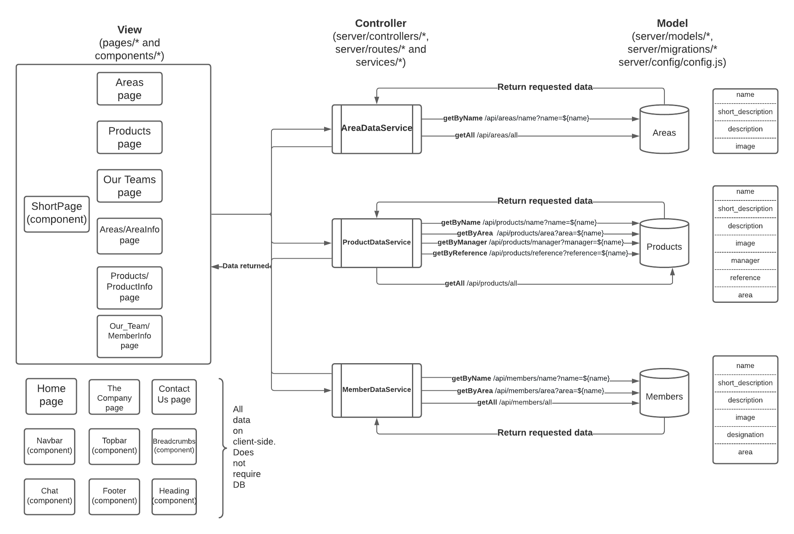

# Hypergnocchi
## Group Members
- Aida Gasanova 10732229‌ aida.gasanova‌@mail.polimi.it
- Lorenzo‌ ‌Grossi‌ ‌10570753‌ lorenzo.grossi@mail.polimi.it‌
- Veronica‌ ‌Lucchetti ‌10539391‌ ‌veronica.lucchetti@mail.polimi.it
- Sairaghav‌ ‌Venkataraman‌ ‌10767948‌ sairaghav.venkataraman@mail.polimi.it

## Group Member Contribution
- **Aida Gasanova:** 
```
1. Low-fidelity wireframes
2. High-fidelity wireframes
3. Code for Homepage (pages/index.vue), Contact Us (pages/contact_us.vue) and Company (pages/the_company.vue)
4. Design document
```
- **Lorenzo Grossi:**
```
1. C-IDM and P-IDM
2. High-fidelity wireframes
3. Code for Area (pages/areas.vue), Products (pages/products.vue) and Our Team (pages/our_team.vue) introduction pages
4. Design document
```
- **Veronica Lucchetti:**
```
1. C-IDM and P-IDM 
2. Code for individual areas (pages/Areas/AreaInfo.vue), individual products (pages/Products/ProductInfo.vue) and individual team member pages (pages/our_team/MemberInfo.vue)
3. Collection of data for all members, products and areas
4. Logo design
5. Design document
```
- **Sairaghav Venkataraman:**
```
1. High-fidelity wireframes
2. Code for components - Navbar (components/Navbar.vue), Breadcrumbs (components/Breadcrumbs.vue), Footer (components/Footer.vue), Shortpage (components/Shortpage.vue), Heading (components/Heading.vue), Topbar (components/Topbar.vue)
3. Chatbot (components/Chat.vue, mixins/mmcc-mixin.js and Chatbot/chatbot-config.json)
4. CSS (layouts/default.vue), Error page (layouts/error.vue)
5. Services to access DB (services/*)
6. Axios config for API (http-common.js)
7. Server (server/routes/*, server/server.js)
8. DB (server/models/, server/migrations/*, server/config/*, server/controllers/*)
9. Github README
```

## Architecture



## Technical Documentation
- **Server and DB Technologies:** Detailed information provided in [server/README.md](./server/README.md)
- **Components Developed and their structure:** Each element of the page is split into components and code is re-used to the maximum extent possible. Almost ALL of the content is displayed with only one component (ShortPage.vue) depending on the props passed to it. [components/README.md](./components/README.md)
- **Style and Layout:** All the styles and elements are defined in layouts/default.vue. Styles are defined in individual files ONLY if there is a need to over-write any specfic property. `viewport-height (vh)` and `viewport-width (vw)` are used wherever possible to adjust to available viewport instead of specific number of pixels. Detailed information provided in [layouts/README.md](./layouts/README.md)
- **Plugins:** Plugins used are `Sequelize` for DB-related tasks, `axios` for API, `vue-router` for routing for server, `express` for setting up the server, `mmcc` for chatbot. Detailed information provided in [plugins/README.md](./plugins/README.md)
- **Chatbot:** Very little changes were made to the components related to chat and only changes were the position of the chat button, color of message box and responsiveness to device width (media query). [Chatbot/README.md](./Chatbot/README.md)

## Compliance to best-practices of framework

**Consistency of page design, colors and font:**

- **Consistent design CSS, fonts and colors (layouts/default.vue):** Making use of layouts folder provided by Nuxt for easy management of consistent CSS and components across all pages. Detailed explanation provided in [layouts/README.md](./layouts/README.md)

- **Common error page (layouts/error.vue):** Making use of layouts folder provided by Nuxt for common error page for all errors encountered by user. Detailed explanation provided in [layouts/README.md](./layouts/README.md)

**Re-usability of code:**

- **Re-usable CSS**: Most of the CSS to be re-used is configured in layouts/default.vue and CSS is only added to individual pages if there is a need to over-write some styles for the specific page. All styles that is necessary only for the particular page is provided with `scoped` attribute. Detailed explanation provided in [layouts/README.md](./layouts/README.md)

- **Re-usable code**: Almost ALL the information in the website is displayed using a SINGLE component (components/ShortPage.vue). Each part of the web-page is written as a set of components (Navbar, Footer, Topbar, Chat, Heading and ShortPage) and displayed as necessary.
Detailed explanation provided in [components/README.md](./components/README.md)

**Adherence to project specification:**

- **Responsiveness**: The website is responsive and will adapt to the device height and width due to the use of CSS Media queries.
The @media query is configured in layouts/default.vue, components/ShortPage.vue, components/Navbar.vue and components/Chat.vue

1. **layouts/default.vue**
```
/*Define properties if screen width < 800 px */
@media only screen and (max-width: 800px) {
  /*Do not use flexbox for display-details */
  .display-details {
    display: block;
  }
  /*Do not use 300x300 image size if device is small*/
  .display-details img {
    width: 100%;
  }
  /*Do not lock topbar position on top if device is small*/
  .topbar {
    display: block;
    position: relative;
    top: 0vh;
  }
}
```

2. **components/ShortPage.vue**
```
/*The image for area will be adjusted depending on screen size. */

@media only screen and (max-width: 800px) {
    .area-content img {
        width: 70vw;
        height: 40vh;
    }
}
```

3. **components/Navbar.vue**
```
/*Adjust navbar as block and not flex when device width is less than 800 px */
@media only screen and (max-width: 800px) {
  /*Do not lock navbar on top when device width is small*/
  .navbar {
    display: block;
    position: relative;
  }
  /*Define size of logo for small device*/
  .logo img {
    height: 10vh;
    width: 100vw;
  }
}
```

4. **components/Chat.vue**
```
}
/*Adjust position of chat button when screen width is less than 800px*/

@media only screen and (max-width: 800px) {
  .button {
    bottom: 6vh;
    right: 2vw;
  }
}
```

**Adherence to applicable usability heuristics:**

- **Visibility of system status:** The breadcrumbs are displayed on top of every page and there are landmarks in header and footer in all pages. The top bar with the navigation and the breadcrumbs is displayed on top wven if user scrolls down on the page.

- **Match between system and the real world:** Well-known terms like Products, Team, About and Contact are used throughout the website.

- **Consistency and standards:** The consistency is implemented through the re-usability of components and default.vue in layouts for CSS and behavior.

- **Error prevention:** In the 2 pages that require user input, message is displayed if there is a need to fill all fields nad if user entry matches validation of field (e.g. email)

- **Help users recognize, diagnose and recover from errors:** Common error page is displayed when user encounters an error (layouts/error.vue). In the 2 pages that require user input, message is displayed if there is a need to fill all fields nad if user entry matches validation of field (e.g. email)

